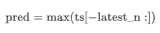
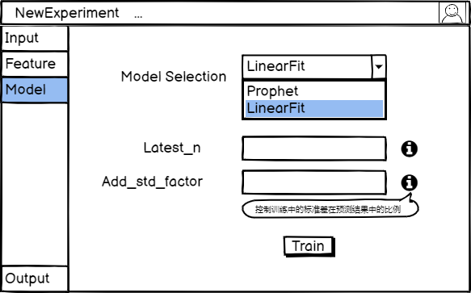

## Environment/Architecture

### Overview 
Rishi是易用的、鲁棒的时间序列预测工具。用户可以上传时间多时间序列文件、选择feature，通过Rishi提供的模型或自定义的模型进行时间序列预测。Rishi也将基于Auto-ML，提供模型融合和调参的功能。

交互方式可以参考[网站](https://rjshanahan.shinyapps.io/Time-Series-Forecasting-with-Shiny/)

### Production Environment

- Software

  Rishi 预计通过 Container 进行 Web 应用的部署，目标的 Host OS 偏向于 Linux。同时每一个计算任务将运行在一个 Container 中，我们将可能借助 Kubernetes 进行 Container 的管理。

- Hardware

  Rishi 涉及对时间序列预测模型的训练，需要满足在计算量较大情况下的并发需求。初步设计中，当用户量较小时，我们的硬件应至少满足以下条件：

  - 16GB RAM
  - 8 Cores CPU
  - 1TB Storage: 由于需要存储用户任务训练后的模型和数据，因此会需要比较大的存储空间
  - Gigabyte Network: 满足大量数据的上传和下载。

  我们可能会借助云服务商来提供部署平台。

### Architecture Design

#### 分层设计

Rishi 将大致分为三层，其中一层为前端，将负责与用户进行交互，并向后端请求和返回数据。后端则将分为两部分，其中一部分是网络应用中 Django 为核心的一层，主要负责用户请求的处理和页面数据的返回。另外一部分是项目的核心部分，将负责计算任务的分发和执行，需要进行最佳参数的搜索和模型的训练。这一部分计算任务将运行在独立的 Container 中，并通过 Contrainer Manager (如 Kubernetes) 进行管理。

#### 模块子系统设计

Rishi 将主要分成以下模块：

- User interface
- Input module
- Data pre-processing module
- Model execution and parameter search module
- Output module

#### 时间序列预测模型

#### AdaptiveAvgModel

**基础介绍**

选用最优长度区间的均值进行预测

**数学定义**

**超参数含义**

1. round_non_negative_int_func(next_n_prediction_list : list) -> list : func
   
2. evaluation_function(pred : list, actual : list, model_name : string) -> double : func
   evaluation的函数
3. eval_len: int
   如数学定义中所述，定义了搜索范围

**基本流程**

在[1, eval_len + 1]的区间内遍历区间长度，找到最优长度区间，利用最优长度区间的均值进行预测

**算法优劣分析**

- 优势：算法较为简单
- 劣势：预测结果较为单一

**常用场景**

不适用于带有额外feature的情况

#### LinearFit

**基础介绍**

利用最小二乘法进行线性回归。

**数学定义**

**超参数含义**

1. latest_n : int 用序列中latest_n项做预测
2. add_std_factor : double 控制训练中的标准差在预测结果中的比例

**基本流程**

用时间序列中`latest_n`项做线性回归，并加上线性回归的标准差

**算法优劣分析**

- 优势：算法较为简单，可以较好地刻画序列单调性特征
- 劣势：对于周期性、多次项的时间序列效果不好

**常用场景**

序列单调增长或减少，不适用于带有额外feature的情况

#### MaxNModel

**基础介绍**
用时间序列中`latest_n`项中最大值做预测

**数学定义**

**超参数含义**

1. lastest_n : int 用序列中lastest_n项做预测

**基本流程**

用时间序列中`latest_n`项中最大值做预测

**算法优劣分析**
- 优势: 算法较为简单
- 劣势: 预测效果差

**常用场景**
不适用于带有额外feature的情况

#### NewRandomArrivalModel

**基础介绍**
判断当前时间点是在上行段还是在下行段，根据事先选定的模拟上下行段的策略，进行预测

**数学定义**

指数、e指数、线性函数的数学形式

**超参数含义**
1. spike_detect_lag : int 
   
   default: 12

   In spike detection algorithm, it describes the lag of the moving window
2. spike_detect_std_threshold : int
   
   default: 2

   In spike detection algorithm, the z-score at which the algorithm signals
3. spike_detect_influence : double
   
   default: 0.5
   
   In spike detection algorithm, the influence (between 0 and 1) of new signals on the mean and standard deviation
4. latest_n : int
   用latest_n项进行预测
5. rise_strategy : enum{"exponential", "expectation", "linear, "auto"}
   
   预测中上行段的策略
   1. "exponential": rise_alpha ^ rise_step
   2. "expectation": confidence * avg_spike_height
   3. "linear": rise__k * rise_step
   4. "auto": pred_expectation if confidence < confidence_threshold else max(pred_exponential, pred_expectation)
6. decline_strategy : enum{"exponential", "expectation", "linear"}
  
   预测中下行段的策略
   1. "exponential": decline_alpha ^ decline_step
   2. "expectation": e ^ rise_step
   3. "linear": decline__k * decline_step
7. confidence_threshold : double 
   
   在上行段预测中的auto策略中，控制confidence阈值
8. height_limit : enum{"average", "max_n"}
   
   在上行段预测中，设置spike_limit的策略
   1. "average": limit = avg_spike_height
   2. "max_n":  limit = max(spike_height[-n:])

**基本流程**
训练过程中，检测训练时间序列中的上行段和下行段，并计算以下参数用于预测

1. has_spike: 是否不是单调的
2. avg_rise_length: 上行段平均长度
3. avg_spike_height: 平均峰值
4. avg_decline_length: 下行段平均长度
5. avg_valley_height: 平均谷值
6. rise_k: avg_rise_length / avg_rise_length
7. rise_alpha: avg_spike_height**(1/avg_rise_length)
8. spike_interval: 每一个峰值和谷值之间的间隔
9. expon_params: 用e指数函数对spike_interval进行回归，计算e指数的lambda
10. last_spike_height: spike_height中的最后一个
11. decline_alpha: last_spike_height**(1/avg_decline_length)
12. decline_k: (avg_spike_height) / avg_decline_length

预测阶段，判断当前时间点是在上行段还是在下行段，根据事先选定的模拟上下行段的策略，进行预测

预测中上行段的策略
   1. "exponential": rise_alpha ^ rise_step
   2. "expectation": confidence * avg_spike_height
   3. "linear": rise__k * rise_step
   4. "auto": pred_expectation if confidence < confidence_threshold else max(pred_exponential, pred_expectation)

预测中下行段的策略
   1. "exponential": decline_alpha ^ decline_step
   2. "expectation": e ^ rise_step
   3. "linear": decline__k * decline_step

**算法优劣分析**

- 优势: 可以较好地刻画具有多个峰值的时间序列和周期性时间序列
- 劣势: 对于不符合指数、e指数、线性概率分布函数的时间序列效果不好

**常用场景**

适用于有多个spike的情况，上行段和下行段符合指数、e指数、线性概率分布函数

## Interface/Interaction

### 程序接口

UI基本按照处理步骤进行

#### Input

用户点击左上角”Input"选项，进入上传文件功能，限制用户上传的文件格式和大小，并且只上传一个文件。可以选择拖拽上传或者在文件资源管理器中选择文件两种方式，用户任选一种即可。文件上传成功或失败会在顶部弹出对应成功或失败的消息提示，如果上传成功，页面下方会显示上传的数据表格的前五行内容。数据上传成功后，进入下一步。

#### Select Column

用户点击下拉菜单出现上传表格的列信息，需要用户选择表格中对应时间序列和值的两列的名称，点击Upload上传成功后进入下一步。[TODO]

#### Select Cycle

页面显示常见的时间序列预测中的特征值，包括但不限于关于不同时间单位的周期性以及假期等特征。用户根据实际情况勾选一个或多个周期单位，并按照提示的格式输入假期信息。如果用户对于选项存在疑问，可以通过将鼠标放置在icon上获得相应的帮助信息。用户输入和选择完成后，点击upload按钮提交。提交成功，进入下一步。[TODO]

#### Model

这个界面帮助用户完成模型以及相应参数的选择，同时提供信息帮助用户更好的进行决策。用户点击Model Selection对应的下拉菜单可以看到提供的多个不同的模型。用户选择一个模型之后，下方显示该模型对应的可调节的参数以及预训练的参数值。用户可以通过将鼠标放置在对应的icon上了解参数对应的含义以及推荐的调参方法。 在模型选择和参数调节结束之后，用户点击"Train"按钮开始训练。

#### Output

训练结束之后，以表格的形式输出预测结果。同时使用用户提供的时间序列、预测结果以及置信区间的相关信息绘制出曲线图。除此之外，包含

- ME: Mean Error
- RMSE: Root Mean Squared Error
- MAE: Mean Absolute Error
- MPE: Mean Percentage Error
- MAPE: Mean Absolute Percentage Error
- MASE: Mean Absolute Scaled Error
- ACF1: Autocorrelation of errors at lag 1

的表格展示模型的准确性。用户可以点击"Download"按钮，将结果保存下来。

## Process/Threading

Rishi 由于是个 Web App，其在 Web Server 部分的并发将主要由 Django Framework 来负责。

而此项目的核心是提供时间序列预测任务的 Training 和 Inference，涉及到大量的计算任务，因此需要比较完整的并发支持，包括资源限制，负载平衡。我们预计将通过容器的方式提供此部分任务的运行环境。并通过 Kubernetes 进行管理。

