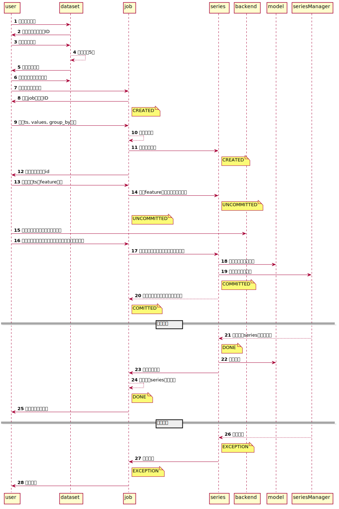

# Sequence


1. 13, 16 提交series的feature, model, hyper_param: `/job/job_id/` PATCH 

    Content-Type: application/json
    ```text
    [{"model_name": "LinearFit","hyper_params":{},"ts_id": 1700,"feature_indexs": "[1, 2]"}]
    ```

2. 9 提交job的ts, group_by, target设置: `/job/job_id/` PUT
   index名称参见swagger
3. 查看ts可用的features, groupby_key, groupby_val
   ```
   {
    "features": [],
    "ts_details": [
        {
            "ts_id": 1,
            "groupby_val": "('asiasoutheast', 'FS')",
            "groupby_key": [
                "Region",
                "VMSeries"
            ]
        },
        {
            "ts_id": 2,
            "groupby_val": "('ussouth', 'A')",
            "groupby_key": [
                "Region",
                "VMSeries"
            ]
        }
    ]
   ```
4. 数据集header和预览数据: `/data/data_id/` GET
   ```json
   {
    "data": {
        "id": 2,
        "name": "test_dataset",
        "uuid": "13740a08-1edd-49be-8d3f-1784e79a8e1d",
        "time_created": "2020-11-09T14:52:53.002395+08:00",
        "upload": "/uploads/allRegion_37d_MSDN_vmlevel.csv",
        "related_user": 1
    },
    "header": [
        {
            "index": 0,
            "label": "Region"
        },
        {
            "index": 1,
            "label": "VMSeries"
        },
        {
            "index": 2,
            "label": "ObjectTime"
        },
        {
            "index": 3,
            "label": "sum_PeakDailyCores"
        }
    ],
    "status": 200,
    "heads": {
        "Region": [
            "asiasoutheast",
            "ussouth",
            "ussouth",
            "europewest",
            "asiasoutheast"
        ],
        "VMSeries": [
            "FS",
            "A",
            "D",
            "B",
            "B"
        ],
        "ObjectTime": [
            "2020-08-01 00:00:00.0000000",
            "2020-08-01 00:00:00.0000000",
            "2020-08-01 00:00:00.0000000",
            "2020-08-01 00:00:00.0000000",
            "2020-08-01 00:00:00.0000000"
        ],
        "sum_PeakDailyCores": [
            152,
            1377,
            234,
            11912,
            3866
        ]
    }   
    ```
5. 模型初始化以及发出训练请求 /job/job_id/ PATCH

不需要调参的请求格式
```json
[
    {
        "model_name": "LinearFit",
        "max_eval": 100,            // 调参搜索的次数
        "next_k_prediction": 5,     // 预测的ts的天数
        "auto_tune": 0,             // 0为不调参
        "eval_metrics":["mse", "rmse"], 
        "hyper_params":[
            {
                "name": "latest_n", 
                "type": "int",
                "val": 5
            },
            {
                "name": "add_std_factor",
                "type": "float",
                "val": 0.5
            }
        ],
        "ts_id": 8797,
        "feature_indexs": "[]"
    }
]
```
需要调参的请求格式
```json
[
    {
        "model_name": "LinearFit",
        "max_eval": 100,
        "next_k_prediction": 5,
        "auto_tune": 1, 
        "eval_metrics":["mse", "rmse"], 
        "hyper_params":[
            {
                "name": "latest_n", 
                "type": "int",
                "low": 1,
                "high": 5
            },
            {
                "name": "add_std_factor",
                "type": "float",
                "low": 0,
                "high": 0.5
            }
        ],
        "ts_id": 8797,
        "feature_indexs": "[]"
    }
]
```

对于是选项的参数
```json
{
    "name": "strategy",
    "type": "list",
    "choice": []
}
```
可选的metrics
```
METRICS = {
    "mse": mse,
    "rmse": rmse,
    "nrmse": nrmse,
    "me": me,
    "mae": mae,
    "mad": mad,
    "gmae": gmae,
    "mdae": mdae,
    "mpe": mpe,
    "mape": mape,
    "mdape": mdape,
    "smape": smape,
    "smdape": smdape,
    "maape": maape,
    "mase": mase,
    "std_ae": std_ae,
    "std_ape": std_ape,
    "rmspe": rmspe,
    "rmdspe": rmdspe,
    "rmsse": rmsse,
    "inrse": inrse,
    "rrse": rrse,
    "mre": mre,
    "rae": rae,
    "mrae": mrae,
    "mdrae": mdrae,
    "gmrae": gmrae,
    "mbrae": mbrae,
    "umbrae": umbrae,
    "mda": mda,
    "bias": bias,
    "r2": r2_score,
}
```
6. get results: job/job_id/job_results/
如果已经执行完毕:
```json
{
    "status": 3,
    "results": [
        {
            "ts_id": 1,
            "results": [
                {
                    "predictions": [
                        239,
                        241,
                        243,
                        245,
                        247
                    ],
                    "timestamps": [
                        "2020-09-08 00:00:00",
                        "2020-09-09 00:00:00",
                        "2020-09-10 00:00:00",
                        "2020-09-11 00:00:00",
                        "2020-09-12 00:00:00"
                    ],
                    "metrics": {
                        "mse": 356.4,
                        "rmse": 18.878559267062727
                    },
                    "config": [
                        {
                            "name": "latest_n",
                            "type": "int",
                            "val": 5
                        },
                        {
                            "name": "add_std_factor",
                            "type": "float",
                            "val": 0.5
                        }
                    ]
                },
                {
                    "predictions": [
                        230,
                        229,
                        228,
                        227,
                        226
                    ],
                    "timestamps": [
                        "2020-09-08 00:00:00",
                        "2020-09-09 00:00:00",
                        "2020-09-10 00:00:00",
                        "2020-09-11 00:00:00",
                        "2020-09-12 00:00:00"
                    ],
                    "metrics": {
                        "mse": 18.6,
                        "rmse": 4.312771730569565
                    },
                    "config": {
                        "add_std_factor": 0.09209359741793716,
                        "latest_n": 4.0
                    }
                }
            ]
        },
        {
            "ts_id": 2,
            "results": [
                {
                    "predictions": [
                        1544,
                        1599,
                        1653,
                        1708,
                        1762
                    ],
                    "timestamps": [
                        "2020-09-08 00:00:00",
                        "2020-09-09 00:00:00",
                        "2020-09-10 00:00:00",
                        "2020-09-11 00:00:00",
                        "2020-09-12 00:00:00"
                    ],
                    "metrics": {
                        "mse": 115500.0,
                        "rmse": 339.8529093593286
                    },
                    "config": [
                        {
                            "name": "latest_n",
                            "type": "int",
                            "val": 5
                        },
                        {
                            "name": "add_std_factor",
                            "type": "float",
                            "val": 0.5
                        }
                    ]
                }
            ]
        },
        {
            "ts_id": 3,
            "results": [
                {
                    "predictions": [
                        126,
                        130,
                        135,
                        140,
                        145
                    ],
                    "timestamps": [
                        "2020-09-08 00:00:00",
                        "2020-09-09 00:00:00",
                        "2020-09-10 00:00:00",
                        "2020-09-11 00:00:00",
                        "2020-09-12 00:00:00"
                    ],
                    "metrics": {
                        "mse": 911.8,
                        "rmse": 30.196026228628163
                    },
                    "config": [
                        {
                            "name": "latest_n",
                            "type": "int",
                            "val": 5
                        },
                        {
                            "name": "add_std_factor",
                            "type": "float",
                            "val": 0.5
                        }
                    ]
                }
            ]
        }
    ]
}
```
如果未执行完毕
```json
{
    "status": 2
}
```
status含义
```py
class CmdStatus(models.IntegerChoices):
    CREATED = 0
    UNCOMITTED = 1
    COMITTED = 2
    DONE = 3
    EXCEPTION = 4
```